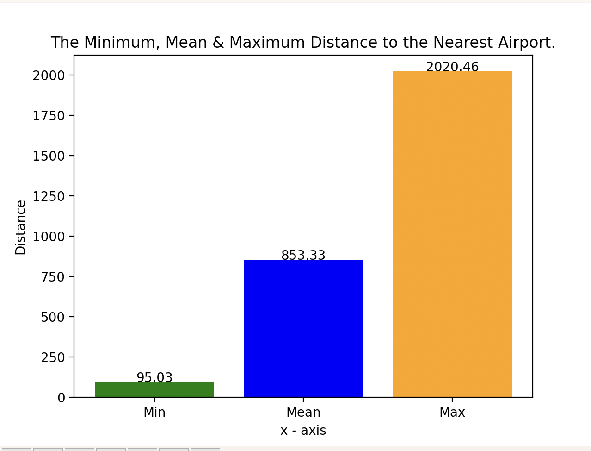

# IS 597: Monte Carlo Simulation to Derive Landing Distance Required by a Flight ✈️

## Team Members
Aarushi Apte, Prateek Bansal, Jannat Singh

## Background

- When in a flight, we all wonder and are curious as to how far the plane will have to travel to land.
- There are numerous elements that determine an aircraft's landing distance, many of which we may not be aware of
- As per International Civil Aviation Organization (ICAO), the horizontal distance traversed by the airplane from a point on the approach path at a selected height above the landing surface to the point on the landing surface at which the airplane comes to a complete stop is called the landing distance
- In the event of an emergency landing, knowing the airports that can accommodate the landing distance required by a flight can reduce the risk of an atrocity hence saving millions of lives.

## Purpose

The purpose of this Monte Carlo Simulation is to calculate the landing distance required by a flight under different circumstances

## Hypotheses

- The difference in the number of airports a flight can land on under usual conditions compared to the ones it can land on under dynamic conditions will not be more than 15%.

- When an aircraft is flying from one destination to another, there will be multiple airports in its path where it can land on in case of an emergency. The maximum and minimum distance to any accommodating airport to the flight will not have a difference of more than 10%.

## Assumptions

- All the flight models considered are fall under the category of Boeing-737.
- All models are of Fixed-pitch propeller type
- We have 6 randomized variables and 1 fixed variable
- Fixed variable- Flap settings of the plane : High

## Randomised Variables

- **Wind:**
There are three types of winds that we have considered
    - Headwind : it reduces the landing distance
    - Tailwind : it increases the landing distance
    - Crosswind : it reduces the landing distance or has no effect at all
- **Runway Surface:**
The Runway Surface greatly affects the landing distance that is required by a flight. These are categorised into 4 types:
    - Normal : 1 
    - Wet : 1.3 to 1.4
    - Standing Water : 2 to 2.3
    - Snow : 1.6 to 1.7
    - Icy : 3.5 to 4.5
- **Surface Gradient:** The landing distance increases by 10 feet for every foot difference between highest and lowest point
- **Gross Weight:** The Boeing 737 flights have been classified under four types:
    - Light
    - Medium
    - Heavy
    - Super Heavy
- **Temperature:** The Landing Distance increases by 5% for increase in temperature of 10 degrees above ISA. We have split the type of temperature into five types, namely:
    - Freezing
    - Cold
    - Pleasant
    - Hot
    - Extreme
- **Airport Altitude:** An increase of 1000 feet in altitude increases the landing distance by 5%

## References

- https://www.faa.gov/regulations_policies/handbooks_manuals/aviation/phak/media/13_phak_ch11.pdf
- https://www.pilot18.com/wp-content/uploads/2017/01/B-737-7-8-900_FCOM_TBC_C_080125_V1V2_B8P-C.pdf
- https://www.mountainflying.com/pages/mountain-flying/rule_of_thumb.html
- https://www.aviation.govt.nz/assets/publications/gaps/Take-off-and-landing-performance.pdf
- https://www.portofbellingham.com/DocumentCenter/View/7196/Revised-Runway-Length-Discussion-20171206?bidId=

